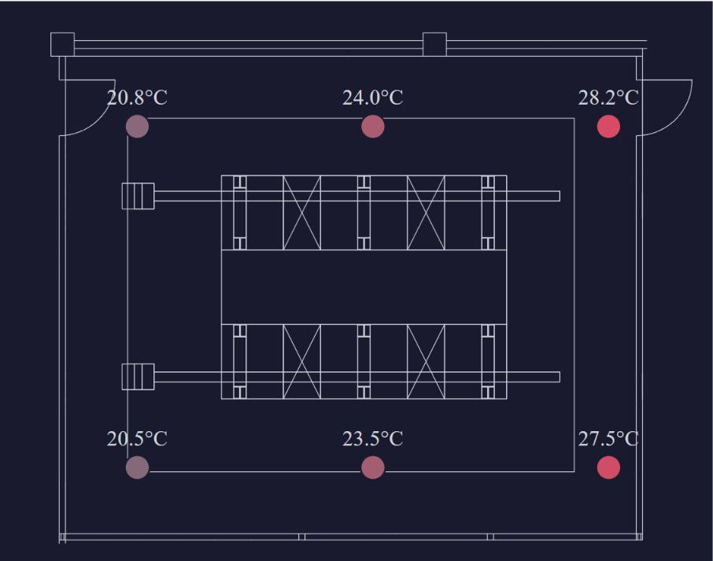
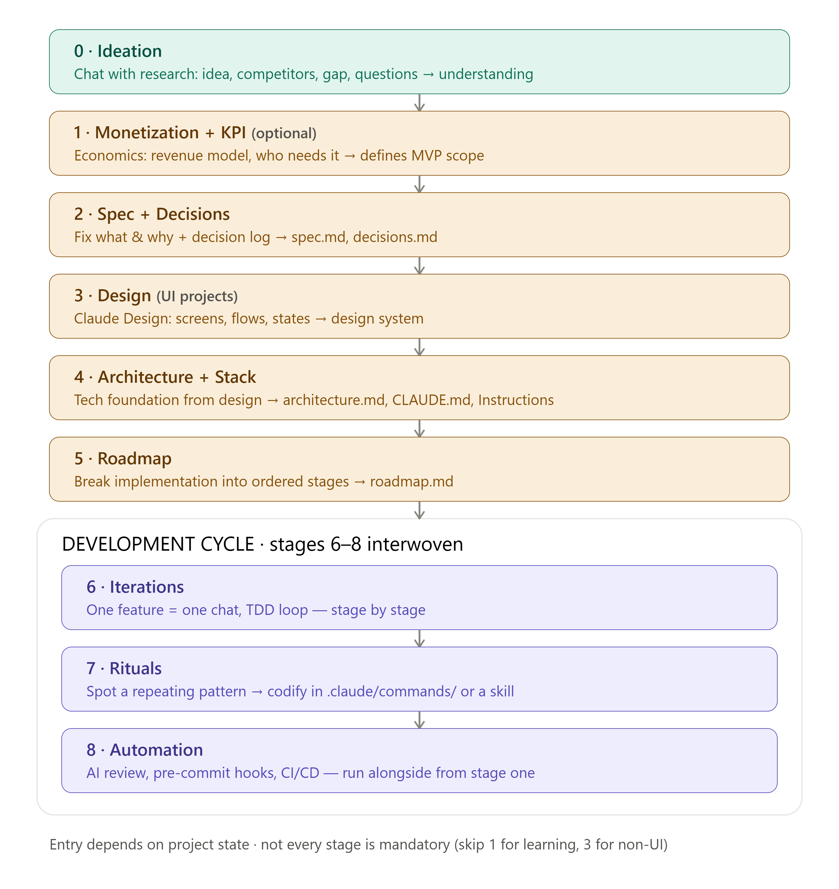

# 📐 Data Centre Floorplan Viewer


[](https://octaipipe-floorplan.vercel.app/)

**[Live demo →](https://octaipipe-floorplan.vercel.app/)**

A React + TypeScript application that renders a data centre hall floorplan from a DXF
file and overlays live sensor readings (temperature / humidity) at their real positions,
with pan/zoom navigation and per-sensor inspection.



* * *

## 🚀 How to run

```bash
npm install
npm run dev        # development server at http://localhost:5173
npm test           # run tests
npm run lint       # lint
npm run format     # format with Prettier
npm run build      # production build
```

* * *

## 🎯 How I Work with AI: Spec-Driven Development

I build software using Spec-Driven Development (SDD) — spec first (what and why), then plan and tasks, and only then code. The same principle behind GitHub Spec Kit and AWS Kiro. The idea is simple: it's cheaper to fix a mistake in the spec than in finished code.

I've deliberately shaped this flow to line up with the generally accepted SDD phases — that's
what lets me later drop dedicated tooling into any one phase (e.g. GitHub Spec Kit for the
docs step) without changing the process itself.

My flow, phase by phase:



Tools I use: Claude Code, MCP

What I'm currently learning (in depth):
- **GitHub Spec Kit** — generates spec artifacts (spec.md, plan.md, tasks.md) straight into the repo via slash commands.
- **Superpowers** — a plugin that enforces TDD and brainstorming discipline, so the agent doesn't jump straight to code.
- **AI code review in CI** — automated review of every PR (CodeRabbit / GitHub Copilot).

Structure turns AI from a demo generator into a production tool. I steer the AI through the spec, review the result, and own the quality. AI amplifies the process, but architectural decisions and verification stay with me.

For this project specifically, that pipeline lives in [`docs/`](docs/): [`spec.md`](docs/spec.md)
(what & why), [`architecture.md`](docs/architecture.md) (structure & layering),
[`decisions.md`](docs/decisions.md) (chosen / rejected / why, for every real trade-off), and
[`roadmap.md`](docs/roadmap.md) (the work broken into stages, one branch + PR each).

> Every non-obvious choice in this codebase traces back to `docs/decisions.md` — chosen,
> rejected, why.

* * *

## 📂 Implementation status, stage by stage

| Stage | What it built | Key decision | Status |
|---|---|---|---|
| 0 — Scaffold | Vite + React + TS + Vitest, folder structure | — | ✅ Done |
| 1 — Coordinate core | Camera pan/zoom math, coordinate types | Pan/zoom written as plain, testable functions before any UI existed — this is the part the brief cares about most | ✅ Done |
| 2 — Floorplan on screen | Parses the real DXF file, renders the hall, pan/zoom on screen | The DXF file's header says millimetres, but the numbers only make sense as metres — checked against the real file instead of trusting the header. Chose SVG over Canvas: simpler for this many shapes, and clicking things works for free | ✅ Done |
| 3 — Sensor overlay | Sensors drawn on the plan, coloured by temperature | Sensor positions come in millimetres, the floorplan is in metres — one simple ÷1000 conversion bridges them. No real sensor data file existed, so I built a placeholder one matching the format described in the spec | ✅ Done |
| 4 — Live cycle | Sensor values update automatically, with loading/error states | Values refresh every ~5s like a real live feed — under the hood it's just replaying a fixed list of readings, but the UI doesn't know that | ✅ Done |
| 5 — Interaction + detail panel | Click/hover a sensor to see its details | — | ⏳ Not started |
| 6 — README + polish | This document | README written; polish pass not done yet | 🔄 In progress |

Full reasoning for every decision above (and a few more) is in [`docs/decisions.md`](docs/decisions.md).

* * *

## ➕ What I'd do next with more time

- Finish Stage 5 — click/hover a sensor to see its details (label, temperature, humidity)
  in a fixed detail panel, with an empty state when nothing's selected.
- A "reset view" control — right now the initial fit-to-view only happens once on load;
  after panning around there's no way back to it without reloading the page.
- Min/max zoom limits — right now you can zoom in or out indefinitely.
- A small legend for the temperature colour scale, so "grey = cool, red-orange = hot" (and
  the actual range) isn't left for the viewer to guess.
- Validate `sensors.json` defensively once a real file exists — right now it's trusted
  blindly since it's my own fixture; a real external file deserves the same
  skip-on-broken-entry approach `normalise.ts` already uses for the DXF.
- Retry affordance on the error state, rather than a dead end requiring a page reload.
- A pre-commit hook (husky) to run lint/test/format automatically, instead of relying on
  doing it by hand before every commit.
- Basic accessibility pass — keyboard navigation between sensors, ARIA labelling on
  markers, focus handling for the detail panel once Stage 5 lands.
- CI (typecheck + lint + test + build on PR) — currently these are run locally before every
  commit, but nothing enforces that on the GitHub side yet.
